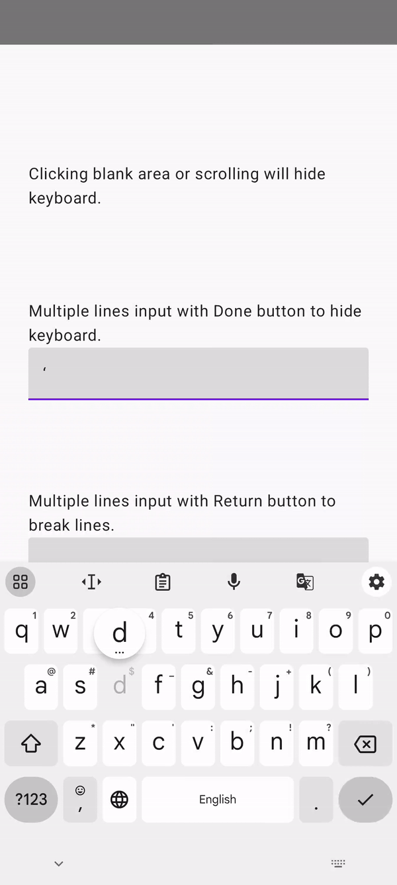

## Intro:

This is a KMP demo app for multiple ways to hide keyboards while editing.

**Focused Problem**: Officially, the Google keyboard has a down arrow button in the bottom left corner to hide the keyboard. However, Apple doesn't have the same feature for the system keyboard.

---

General and recommended way to hide the keyboard on both platforms:

#### 1. Tapping non-editable area or scrolling the screen to hide the keyboard

- This can be done by adding a tap gesture to the container view.
- :upside_down_face:In compose, the tap gesture has a ripple effect that needs to customize for iOS

|               iOS tapping              |               iOS Dragging             |        Android tapping & Dragging        |
|:--------------------------------------:|:--------------------------------------:|:----------------------------------------:|
|  |  |  |

#### 2. Clicking return button to hide keyboard

- This can be done by customizing the return button action of the keyboard.
- :upside_down_face:Then it means users can not break the line by return button.

|                iOS                   |                   Android                |
|:------------------------------------:|:----------------------------------------:|
|  |  |

#### 3. Adding a button on top of the keyboard to hide the keyboard.

- :upside_down_face:This is easy to handle on iOS, but not for compose.
- :upside_down_face:When there is another button like "Submit" in the same place, it will be super ugly to have them both.

|                 iOS                  |
|:------------------------------------:|
|  |

---

Please check details and implementation in 
- ```./composeApp/src/commonMain/kotlin/org/example/project/testdemo/App.kt``` 
- ```./iosApp/iosApp/ContentView.swift```
